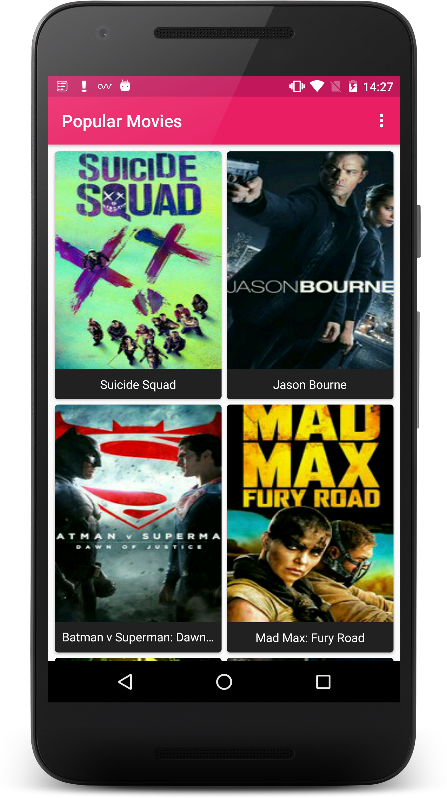
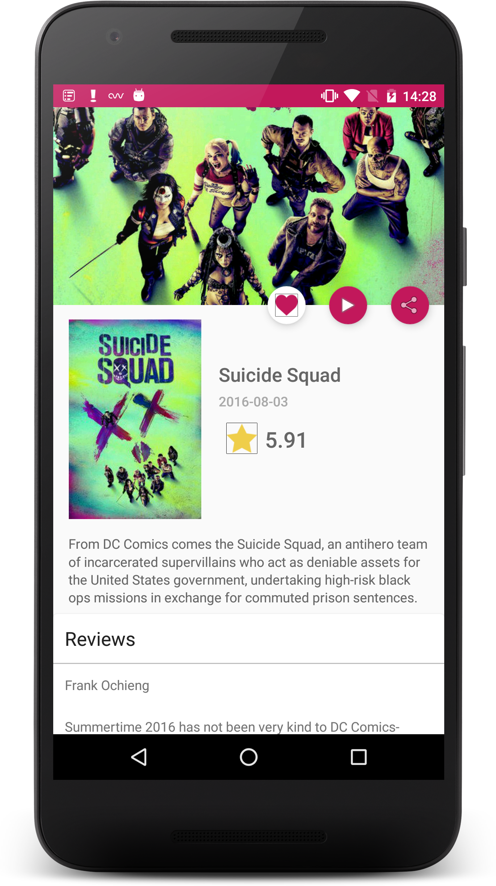
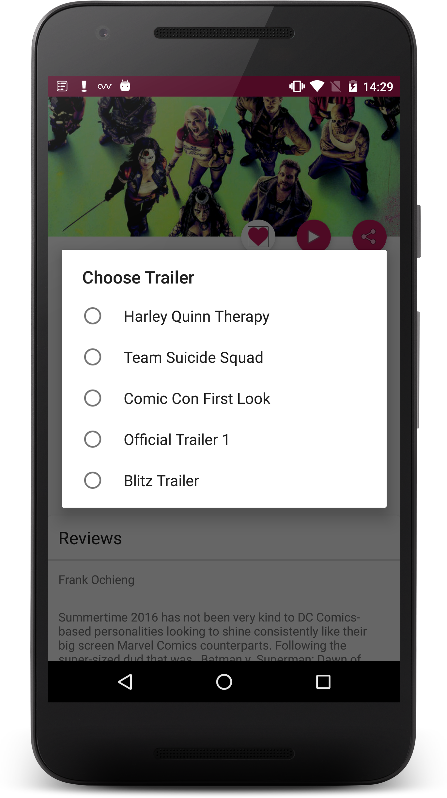
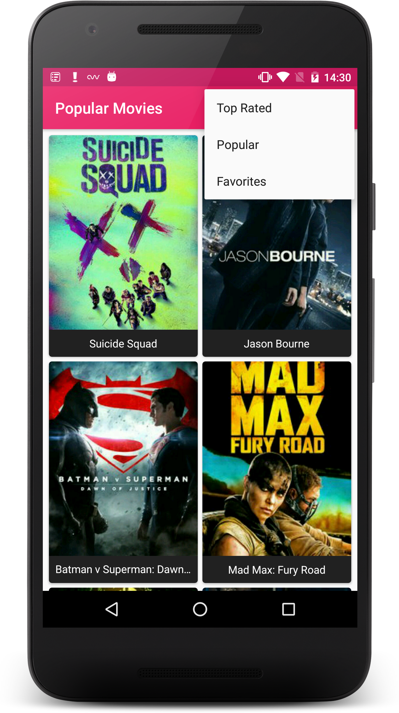
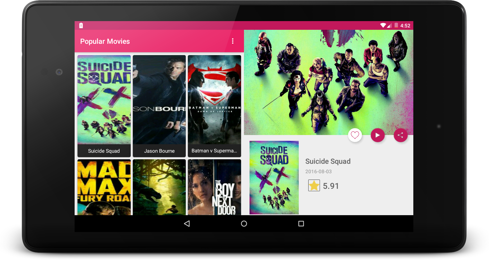

# Popular Movies - Stage2 

An app help to discover movies, sorted by popular, highest rated and Favorite movies.
This is the second project created as part of Android Developer Nanodegree provided by Udacity.

### Features

- Find popular and highest rated movies.
- Distinct layout for your favorite movies
- Offline storage of favorite movies.
- Detailed description with Language, Release Data, Vote Average.
- Reviews with rating for every movie.
- Watch and share trailers available for the movies.

### Libraries Used

- [Butterknife] (https://github.com/JakeWharton/butterknife)
- [Retrofit] (https://github.com/square/retrofit)
- [Glide] (https://github.com/bumptech/glide)
- [Gson] (https://github.com/google/gson)
- [Stetho] (https://github.com/facebook/stetho)
- [SimpleSQLProvider] (https://github.com/ckurtm/simple-sql-provider)
- [Design Library] (https://developer.android.com/topic/libraries/support-library/features.html)
- [Cardview] (https://developer.android.com/topic/libraries/support-library/features.html)
- [Recyclerview] (https://developer.android.com/topic/libraries/supp
ort-library/features.html)

### Screenshots

# License

    Copyright 2016 Nikhil Bhutani

    Licensed under the Apache License, Version 2.0 (the "License");
    you may not use this file except in compliance with the License.
    You may obtain a copy of the License at

    http://www.apache.org/licenses/LICENSE-2.0

    Unless required by applicable law or agreed to in writing, software
    distributed under the License is distributed on an "AS IS" BASIS,
    WITHOUT WARRANTIES OR CONDITIONS OF ANY KIND, either express or implied.
    See the License for the specific language governing permissions and
    limitations under the License.
